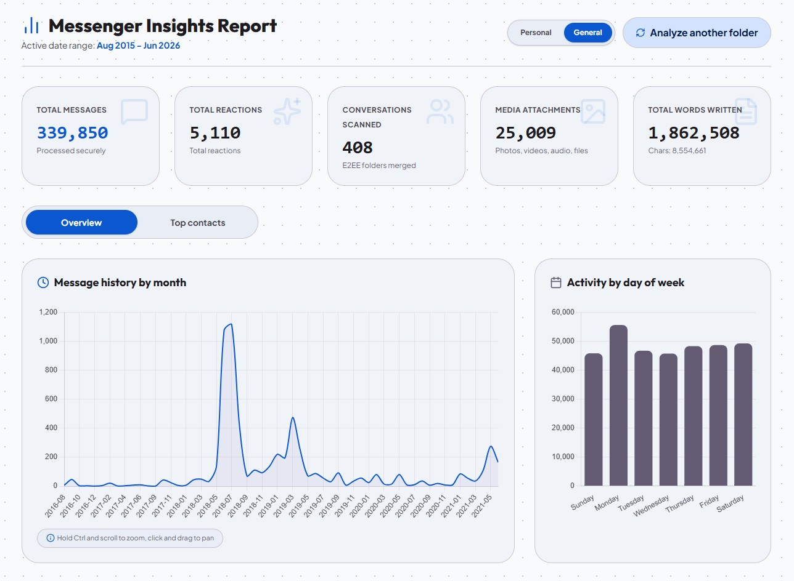
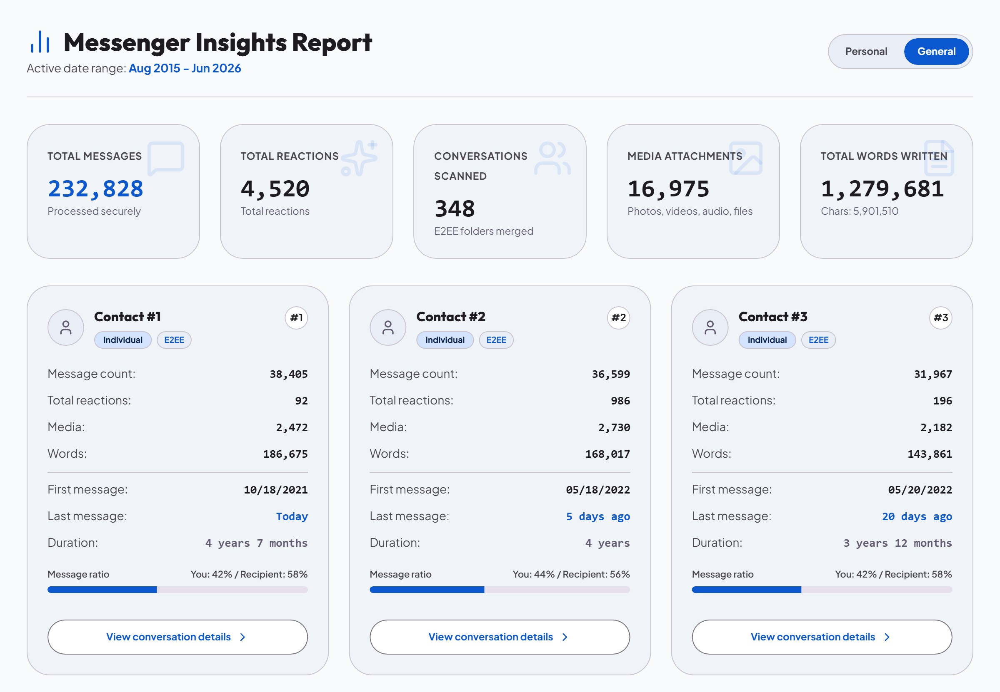
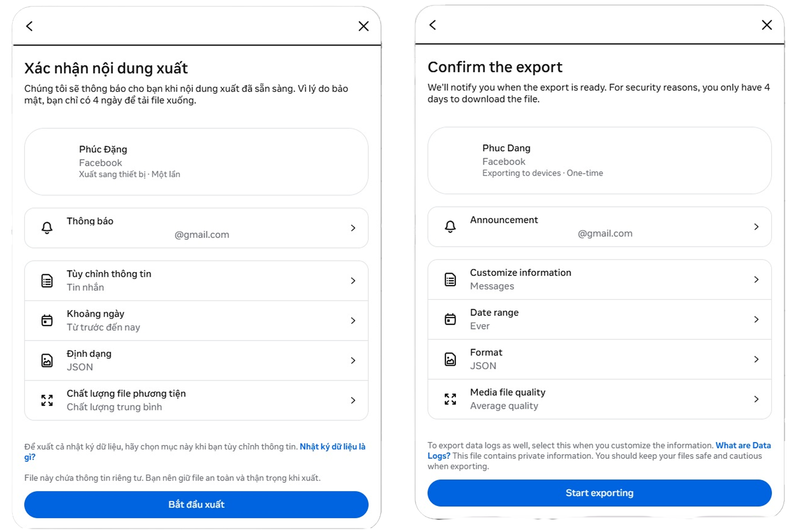
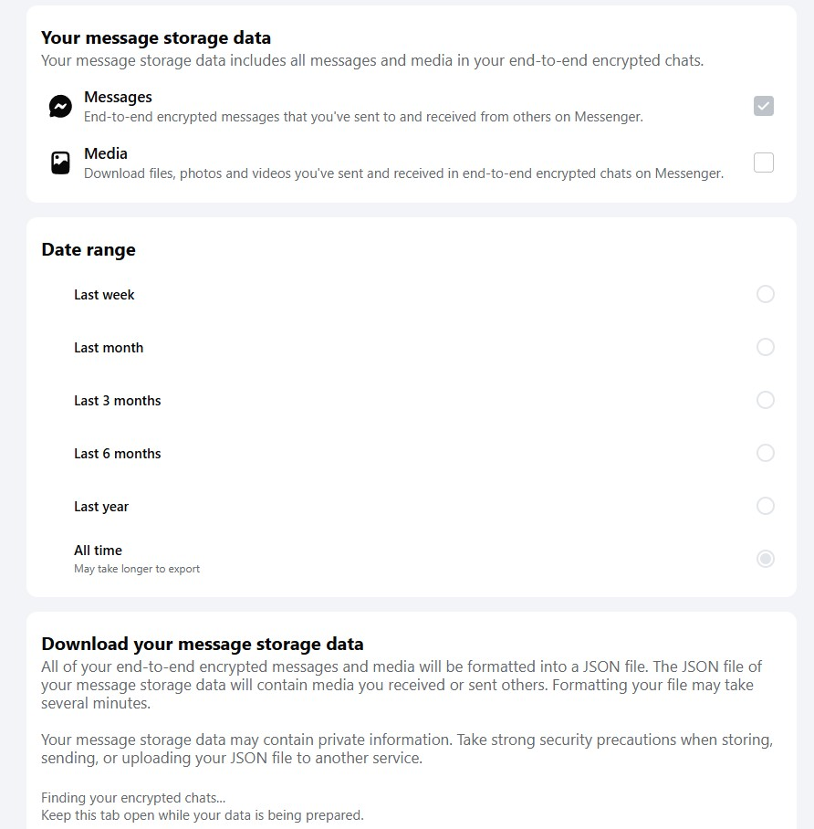

# Messenger Insights & Counter — Bộ phân tích tin nhắn Facebook




[English Version](#english-version) | [Tiếng Việt](#tiếng-việt)

---

## Tiếng Việt

**Messenger Insights & Counter** là một ứng dụng web giúp bạn khám phá số liệu thống kê chi tiết về các cuộc trò chuyện trên Facebook Messenger (hỗ trợ cả tin nhắn mã hóa đầu cuối E2EE và tin nhắn thông thường) một cách trực quan và an toàn. 

Ứng dụng chạy **100% ở phía máy khách (Client-side)**. Dữ liệu của bạn được xử lý cục bộ ngay trên trình duyệt và không có bất kỳ tệp tin hay thông tin cá nhân nào được chuyển lên máy chủ.

### Tính năng nổi bật

1. **Bảo mật & riêng tư**: 
   - Không yêu cầu đăng nhập tài khoản Facebook hay cung cấp token.
   - Xử lý tệp JSON cục bộ thông qua **Web Worker** ở luồng nền, đảm bảo trang web luôn mượt mà.
   - Hoạt động hoàn toàn ở Client-side.
2. **Tự động gộp hội thoại E2EE**:
   - Tự động phát hiện và gộp các thư mục tin nhắn bị phân mảnh do mã hóa đầu cuối (E2EE) hoặc phân tách tệp tin khi Facebook xuất dữ liệu.
3. **Biểu đồ trực quan & tương tác cao**:
   - **Lịch sử nhắn tin theo tháng**: Hỗ trợ phóng to/thu nhỏ (Zoom in/out bằng cách giữ `Ctrl` + cuộn chuột) và kéo qua lại (Pan) để quan sát chi tiết dòng thời gian.
   - **Tần suất theo khung giờ**: Xem bạn và đối phương hay nhắn tin vào khung giờ nào nhất trong ngày (24 giờ).
   - **Tần suất theo thứ**: Biểu đồ phân bổ lượng tin nhắn trong các ngày từ Thứ 2 đến Chủ nhật.
4. **Bảng xếp hạng tương tác (Leaderboard)**:
   - Xếp hạng bạn bè dựa trên số lượng tin nhắn, lượt bày tỏ cảm xúc (reactions), tổng số từ hoặc số ký tự.
   - Xem tỷ lệ gửi tin nhắn giữa bạn và đối phương trong các cuộc trò chuyện cá nhân.
   - Thống kê các từ khóa (từ vựng) được hai bên sử dụng nhiều nhất.
5. **Trình xem lịch sử chat (Interactive Chat Viewer)**:
   - Xem lại lịch sử nhắn tin dưới dạng bong bóng chat quen thuộc, hiển thị các tệp đính kèm đi kèm (Ảnh, Video, GIF, Nhãn dán, Tin nhắn thoại, Tài liệu) và các lượt thả cảm xúc.
6. **Nhận diện ảnh đại diện tự động**:
   - Chỉ cần lưu trang danh sách bạn bè Facebook (lưu ý cuộn chuột xuống dưới cùng để trang web tải hết toàn bộ danh sách bạn bè rồi mới nhấn `Ctrl + S` trên trình duyệt) rồi chọn cùng lúc khi tải thư mục lên, ứng dụng sẽ tự động gán và hiển thị ảnh đại diện của bạn bè.
7. **Xuất bảng xếp hạng (Ảnh & JSON)**:
   - Hỗ trợ xuất bảng xếp hạng top tương tác thành hình ảnh chất lượng cao để chia sẻ. Tùy chọn ẩn danh (ẩn tên/ẩn ảnh đại diện bạn bè) hoặc ẩn phần tổng quan.
   - Hỗ trợ tải dữ liệu bảng xếp hạng dưới định dạng JSON để tiện lưu trữ hoặc xử lý nâng cao.

### Hướng dẫn sử dụng chi tiết

#### Bước 1: Yêu cầu và tải dữ liệu tin nhắn từ Facebook
Facebook phân tách dữ liệu tin nhắn thông thường và tin nhắn được mã hóa đầu cuối (E2EE) thành 2 mục riêng biệt. Để có dữ liệu đầy đủ nhất, bạn cần thực hiện tải cả 2 mục này:

1. **Đối với tin nhắn thông thường**:
   - Truy cập vào liên kết: [Facebook Accounts Center DYI](https://accountscenter.facebook.com/info_and_permissions/dyi)
   - Chọn **Tải thông tin của bạn** (Download Your Information) -> **Yêu cầu bản tải xuống** (Request download).
   - Thiết lập cấu hình: Định dạng tệp bắt buộc là **JSON**, chất lượng file phương tiện chọn **Thấp** (để tối ưu hóa tốc độ tải và xử lý).
   - Trong danh sách dữ liệu, bạn tích chọn duy nhất phần **Tin nhắn** (Messages) giống như hình minh họa dưới đây rồi gửi yêu cầu:
     

2. **Đối với tin nhắn mã hóa đầu cuối (E2EE)**:
   - Truy cập vào liên kết: [Facebook Secure Storage DYI](https://www.facebook.com/secure_storage/dyi)
   - Đăng nhập và tạo yêu cầu tải dữ liệu tin nhắn mã hóa đầu cuối tại đây.
   - Thiết lập cấu hình tương tự: Định dạng tệp là **JSON** và chất lượng file phương tiện chọn **Thấp** như hình minh họa dưới đây rồi gửi yêu cầu:
     

#### Bước 2: Giải nén và chuẩn bị thư mục dữ liệu
1. Khi Facebook chuẩn bị xong, bạn tải các tệp ZIP về máy tính.
2. Bôi đen chọn tất cả các tệp ZIP đó, nhấp chuột phải và sử dụng phần mềm WinRAR chọn **Extract Here** (Giải nén tại đây) để giải nén toàn bộ dữ liệu vào cùng một nơi.
3. Sau khi giải nén, bạn sẽ nhận được thư mục chính chứa dữ liệu có tên là `your_facebook_activity`.
4. Đối với tệp tin nhắn mã hóa đầu cuối (E2EE), hãy đảm bảo rằng thư mục hoặc các tệp tin của nó được đặt bên trong thư mục `your_facebook_activity/messages/` của bạn.
5. Ứng dụng hỗ trợ hai kiểu cấu trúc nạp dữ liệu:
   - **Cấu trúc mặc định của Facebook**: Các tệp tin nhắn nằm sâu trong thư mục như `your_facebook_activity/messages/inbox/ten_cuoc_tro_chuyen/message_1.json`.
   - **Cấu trúc phẳng**: Bạn có thể copy trực tiếp các tệp `.json` tin nhắn ra bên ngoài thư mục `messages/` (ví dụ `your_facebook_activity/messages/ten_cuoc_tro_chuyen.json`), ứng dụng vẫn sẽ tự động nhận diện chính xác.

#### Bước 3: Nạp ảnh đại diện của bạn bè (tùy chọn)
1. Mở Facebook trên trình duyệt máy tính, truy cập vào trang danh sách Bạn bè của bạn.
2. **Quan trọng**: Hãy cuộn chuột liên tục xuống phía dưới cùng cho đến khi trang web tải xong toàn bộ danh sách bạn bè của bạn (không còn bạn bè nào mới xuất hiện khi cuộn nữa).
3. Nhấp chuột phải hoặc nhấn tổ hợp phím `Ctrl + S` (`Cmd + S` trên macOS) để lưu trang web bạn bè dưới dạng HTML (chọn kiểu lưu là *Webpage, Complete* / *Trang web, Toàn bộ*).
4. Khi lưu xong, bạn sẽ nhận được một tệp `.html` và một thư mục đi kèm chứa các tệp ảnh đại diện (thường kết thúc bằng tên `_files`).
5. Hãy di chuyển cả tệp `.html` này và thư mục hình ảnh đi kèm đặt vào bên trong thư mục `your_facebook_activity`.

#### Bước 4: Chạy phân tích trên ứng dụng
1. Mở trang web ứng dụng phân tích tin nhắn.
2. Click vào vùng chọn thư mục trên giao diện và chọn thư mục `your_facebook_activity` của bạn.
3. Trình duyệt sẽ yêu cầu xác nhận quyền truy cập vào thư mục, hãy xác nhận đồng ý để tải lên cục bộ.
4. Chọn các cuộc hội thoại bạn muốn xem số liệu rồi bấm **Bắt đầu phân tích sâu** để hoàn tất.

---

## English Version

**Messenger Insights & Counter** is a web application designed to securely visualize and analyze your Facebook Messenger conversation history (supporting both standard and end-to-end encrypted E2EE messages). 

This application operates **100% client-side**. Your data is processed entirely in your web browser, ensuring that no personal files or messaging details are ever uploaded to a remote server.

### Key Features

1. **Privacy & Security**:
   - No Facebook credentials or access tokens required.
   - Multi-threaded JSON processing utilizing browser **Web Workers** for a fluid UI.
   - Runs entirely client-side.
2. **Smart E2EE Conversation Merging**:
   - Automatically detects and merges split directories caused by Facebook's End-to-End Encryption (E2EE) rollouts or file chunking.
3. **Interactive Visualizations**:
   - **Monthly Message Timeline**: Supports zooming in/out (hold `Ctrl` + scroll wheel) and panning (drag left/right) to navigate your long-term messaging history.
   - **Hourly Frequency (24h)**: Displays your most active hours.
   - **Day-of-Week Distribution**: Breakdown of messages sent from Monday to Sunday.
4. **Interactive Leaderboard**:
   - Rank your contacts by message counts, reactions, words written, or characters typed.
   - View chat distribution ratios (who texted more) for individual direct messages.
   - Display top-20 most frequently used keywords.
5. **Interactive Chat Viewer**:
   - Browse your messaging logs in a clean chat bubble interface, including attachments (Photos, Videos, GIFs, Stickers, Audio, Documents) and reactions.
6. **Dynamic Avatar Mapping**:
   - Save your Facebook friends web page (scroll all the way down to load your entire friends list first, then press `Ctrl + S` on your browser) and select it during directory upload to automatically render profile pictures.
7. **Leaderboard Export (Image & JSON)**:
   - Export your top contacts leaderboard as a high-resolution PNG image ready for sharing. Features display options to anonymize names, hide profile pictures, or hide the overview statistics block.
   - Download leaderboard stats as a structured JSON file for backup or external analysis.

### Detailed Usage Instructions

#### Step 1: Request and download Facebook messaging data
Facebook splits standard messages and end-to-end encrypted (E2EE) messages into two separate portals. For a complete analysis, request and download both:

1. **Standard Messages (Normal Messages)**:
   - Go to: [Facebook Accounts Center DYI](https://accountscenter.facebook.com/info_and_permissions/dyi)
   - Select **Download Your Information** -> **Request a download**.
   - Configuration: Set format to **JSON** (HTML is not supported) and media quality to **Low** (to minimize download size and speed up processing).
   - In the data category selection, check only the **Messages** option as shown below:
     

2. **End-to-End Encrypted Messages (E2EE Messages)**:
   - Go to: [Facebook Secure Storage DYI](https://www.facebook.com/secure_storage/dyi)
   - Log in and request to download your E2EE messaging logs.
   - Configuration: Set format to **JSON** and media quality to **Low** as shown below:
     

#### Step 2: Extract and prepare your folder
1. Once your downloads are ready, download both ZIP archives to your computer.
2. Select both ZIP files, right-click, and use WinRAR to choose **Extract Here** to extract all archives into the same location.
3. This creates a folder named `your_facebook_activity`.
4. For E2EE messages, ensure the E2EE messages directories or JSON files are copied inside your `your_facebook_activity/messages/` directory.
5. The application supports two folder layout structures:
   - **Facebook Default**: Chat files located in subfolders, e.g., `your_facebook_activity/messages/inbox/chat_folder_name/message_1.json`.
   - **Flat Layout**: You can also copy your `.json` chat files directly into the `messages/` folder (e.g., `your_facebook_activity/messages/chat_name.json`), and the application will detect them automatically.

#### Step 3: Map Profile Avatars (Optional)
1. Open Facebook Web on your desktop browser and navigate to your friends list.
2. **Important**: Scroll all the way down to the bottom of the page until your entire friends list is fully loaded (so that no more friends appear as you scroll).
3. Right-click or press `Ctrl + S` (`Cmd + S` on macOS) to save the page (Select *Webpage, Complete* option).
4. This creates an `.html` file and a companion folder ending with `_files` containing the avatar images.
5. Move both the `.html` file and the companion folder inside your `your_facebook_activity` folder.

#### Step 4: Run the analysis
1. Open the web application.
2. Click the folder upload area and select your `your_facebook_activity` folder.
3. Confirm the browser permission prompt to allow local file access.
4. Select the conversations you want to analyze and click **Start deep analysis**.

---

## Development Setup / Hướng dẫn phát triển

Yêu cầu máy tính cài đặt sẵn NodeJS / Requires NodeJS installed.

```bash
# Cài đặt thư viện / Install dependencies
npm install

# Khởi chạy máy chủ phát triển / Run development server
npm run dev

# Biên dịch sản phẩm / Compile production bundle
npm run build
```
